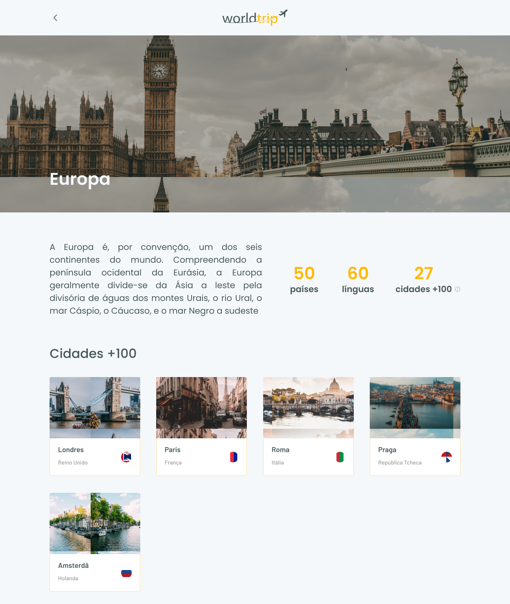

<p align="center">
  
</p>

<h1 align="center">World Trip</h1>
<p align="center">✈️ Aplicação para planajemento de viagens baseado na escolha de um continente</p>

<p align="center">
  
  
</p>

<p align="center">
 <a href="#-tecnologias">Tecnologias</a> •
 <a href="#-projeto">Projeto</a> • 
 <a href="#-layout">Layout</a> • 
 <a href="#-como-executar">Como executar</a> • 
	<a href="#-como-acessar">Como executar</a> • 
 <a href="#-autor">Autor</a> • 
 <a href="#-licença">Licença</a>
</p>

<h4 align="center"> 
	🚧 Finalizado 🚧
</h4>

## 🛠 Tecnologias
As seguintes ferramentas estão sendo usadas na construção do projeto:

- [React](https://pt-br.reactjs.org/)
- [TypeScript](https://www.typescriptlang.org/)
- [Next.js](https://nextjs.org/)
- [Chakra UI](https://chakra-ui.com/)
- [Swiper](https://swiperjs.com/react)

## 💻 Projeto

🌎 World Trip é um app para planejar viagens e conhecer possíveis destinos.

Projeto desenvolvido durante o Ignite da [Rocketseat](https://rocketseat.com.br/). Para saber mais sobre o Ignite [`clique aqui`](https://help.rocketseat.com.br/hc/pt-br/articles/1500003228822-O-que-%C3%A9-o-Ignite-)

## 🎨 Layout

O layout da aplicação está disponível no [`Figma`](https://www.figma.com/file/rQ1avM0R87hUohOx5Q0lK3/Desafio-1-M%C3%B3dulo-4-ReactJS-Copy?node-id=0%3A1)

### Web

<p align="center">
  
  
</p>

### Mobile

<p align="center" style="display: flex; align-items: flex-start; justify-content: center;">
  
  
</p>

## 🚀 Como executar

### Pré-requisitos

Antes de começar, você vai precisar ter instalado em sua máquina as seguintes ferramentas:
[Git](https://git-scm.com), [Yarn](https://yarnpkg.com/). 
Além disto é bom ter um editor para trabalhar com o código como [VSCode](https://code.visualstudio.com/)

#### 🌀 Rodando a aplicação

```bash

# Clone este repositório
$ git clone https://github.com/viniciusoliveiras/worldtrip.git

# Acesse a pasta do projeto no seu terminal/cmd
$ cd worldtrip

# Instale as dependências
$ yarn

# Execute a aplicação
$ yarn dev

# A aplicação será aberta na porta:3000 - acesse http://localhost:3000

```

## 🚪 Como acessar

Você pode acessar a aplicação através [`deste link`](https://worldtrip-viniciusoliveiras.vercel.app/) em seu navegador.

## ✍🏾 Autor
<a href="https://github.com/viniciusoliveiras/">
 
 <br />
 <p>Vinícius Oliveira</p>
</a>  

[](https://www.linkedin.com/in/viniciusoliveiras-01532/)
[](mailto:vinitag190@gmail.com)

## 📄 Licença

Esse projeto está sob a licença MIT. Veja o arquivo [LICENSE](LICENSE) para mais detalhes.

<br />
<br />
<p align="center"><a href="#world-trip">🔝 Voltar ao topo 🔝</a></p>
